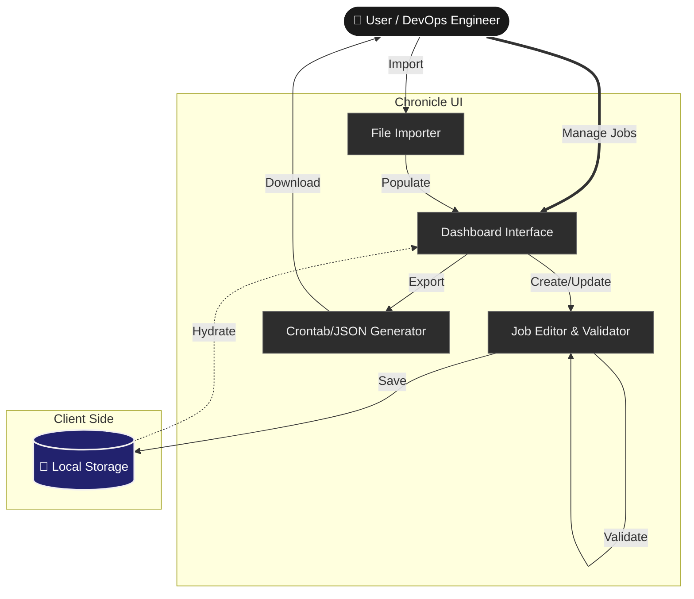

# Chronicle - Modern Cron Job Management


Chronicle is a visual interface designed to simplify the creation, management, and deployment of cron jobs for DevOps teams and System Administrators.

## 🔴 The Problem

Managing cron jobs via the command line (`crontab -e`) is often error-prone and opaque. The cryptographic `* * * * *` syntax lacks readability, and there is no built-in validation or "single pane of glass" to monitor scheduled tasks across different environments. Chronicle solves this by treating Cron Jobs as visual objects with instant validation and easy management.

## 🛠️ Tech Stack

*   **Framework**: [Next.js 15](https://nextjs.org/) (App Router)
*   **Language**: [TypeScript](https://www.typescriptlang.org/)
*   **Styling**: [Tailwind CSS 4](https://tailwindcss.com/)
*   **Icons**: [Lucide React](https://lucide.dev/)
*   **Utilities**: `cron-parser` for validation, `date-fns` for formatting.

## 📂 Modular Code Structure

```bash
├── app/
│   ├── (src)/               # Application Routes
│   ├── components/
│   │   ├── dashboard/       # Feature-specific components (Row, List)
│   │   └── ui/              # Reusable Design System components
│   ├── lib/
│   │   ├── cronImportExport.ts # Import/Export logic
│   │   └── saveCron.ts      # Persistence logic (LocalStorage)
│   └── hooks/               # Logic: React Custom Hooks (useCronJobs)
```

## 🌊 Application Flow



## 🚀 Features

*   **Visual Dashboard**: See all your jobs, their schedules, and commands in a clean table view.
*   **Instant Validation**: Ensure your cron schedules are valid before saving.
*   **Persistence**: Jobs are saved locally, so you don't lose your work on refresh.
*   **Import/Export**: Easily migrate existing crontabs or backup your configuration.

## 🔮 Product Scope

*   **Firebase Integration**: Moving state to the cloud (Firestore) for persistent access across devices.
*   **User Authentication**: Secure Login/Signup for team collaboration.
*   **Role-Based Access**: Granular permissions for viewing vs. editing production jobs.
*   **Server Sync**: Direct SSH integration to pull/push cron jobs to live servers.

## ♾️ DevOps Integration Roadmap

To professionalize the deployment pipeline, the following DevOps practices can be integrated:

1.  **CI/CD Pipeline (GitHub Actions)**:
    -   Automate linting (`npm run lint`) and type checking on every Pull Request.
    -   Automatically deploy to Vercel Preview environments.

2.  **Containerization (Docker)**:
    -   Create a `Dockerfile` for self-hosted deployments.
    -   Use multi-stage builds to keep the image size small.

3.  **Testing Strategy**:
    -   **Unit Tests**: Use **Jest** or **Vitest** to test the `lib` logic (validators).
    -   **E2E Tests**: Use **Playwright** to verify the user flow.

4.  **Monitoring**:
    -   Use **Vercel Analytics** for performance metrics.

## � Getting Started

1.  **Clone the repository**:
    ```bash
    git clone https://github.com/YashashavGoyal/crontab.ui.git
    cd crontab.ui
    ```

2.  **Install dependencies**:
    ```bash
    npm install
    ```

3.  **Run the development server**:
    ```bash
    npm run dev
    ```

4.  **Open locally**:
    Visit [http://localhost:3000](http://localhost:3000) in your browser.

---

**Author**: Yashashav Goyal

<a href="https://github.com/YashashavGoyal">
  
</a>
<a href="https://linkedin.com/in/yashashavgoyal">
  
</a>
<a href="https://twitter.com/YashashavGoyal">
  
</a>

**License**: MIT
