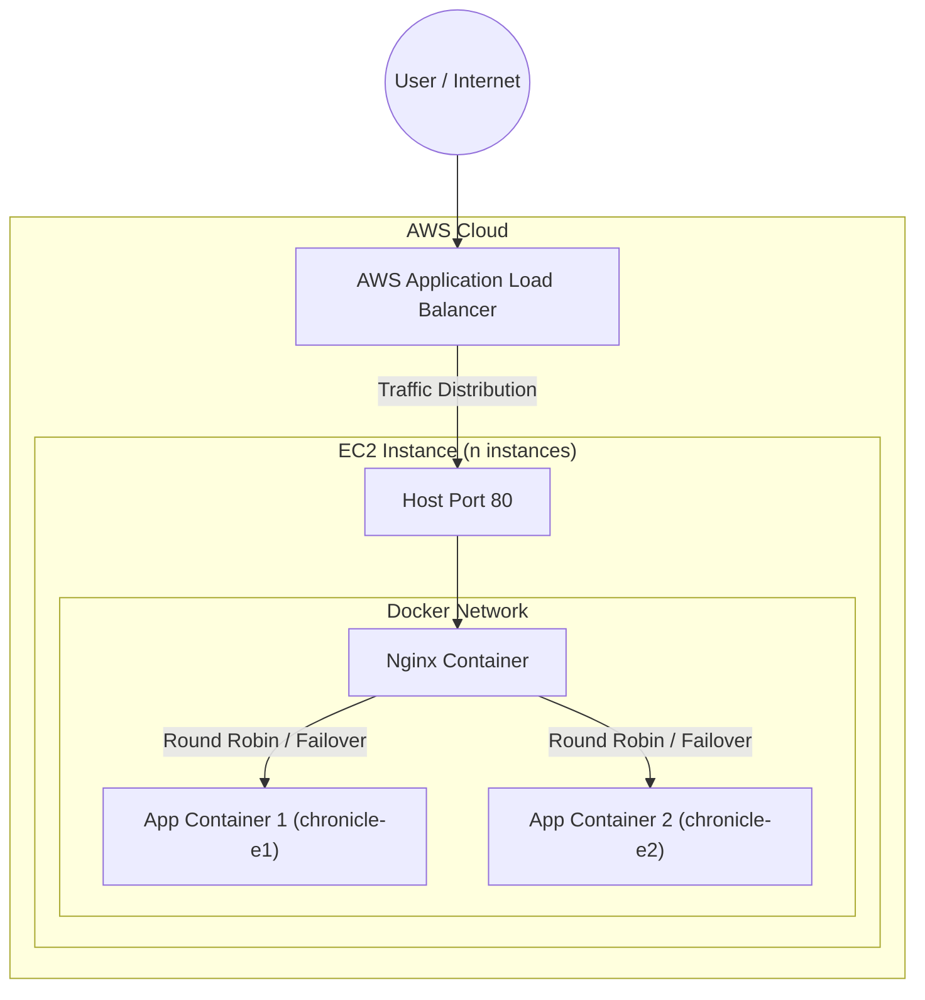
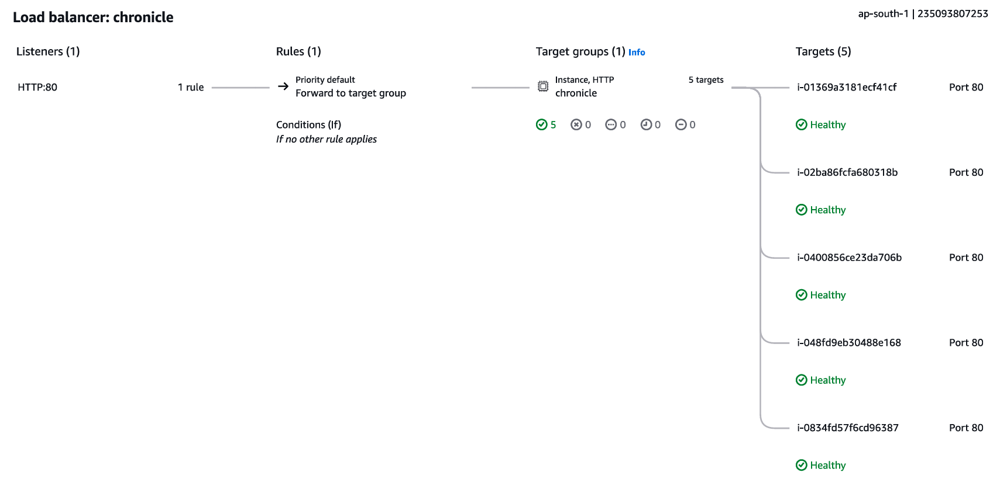
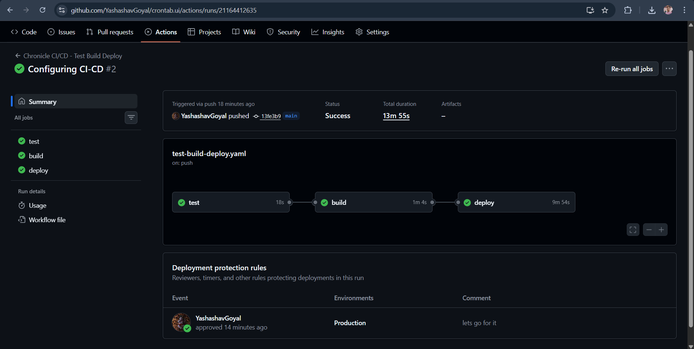
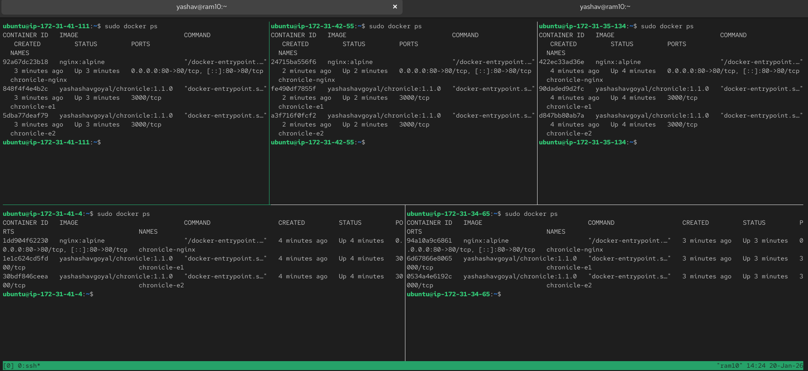
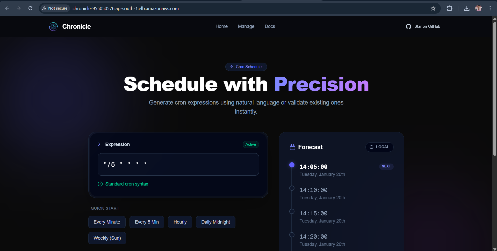

# Chronicle - Modern Cron Job Management

Chronicle is a visual interface designed to simplify the creation, management, and for the visualisation of cron jobs for DevOps teams and System Administrators.

**Live Application**: [Chronicle](https://chronicle-lake.vercel.app)  
**Docker Hub**: [yashashavgoyal/chronicle](https://hub.docker.com/repository/docker/yashashavgoyal/chronicle/)

---

## 🏗️ System Architecture

Our production environment runs on **AWS EC2** instances, orchestrated via **Docker Compose**. We utilize a containerized architecture where each EC2 instance hosts a **reverse proxy (Nginx)** and multiple application containers (`chronicle`).

### Logic
1.  **AWS ALB (Application Load Balancer)**: Distributes incoming traffic across multiple EC2 instances.
2.  **AWS EC2 Instances**: Each instance runs the application stack.
3.  **Docker Compose Network**: Inside each EC2, we run:
    -   **Nginx**: Listens on Host Port 80. Acts as a load balancer and reverse proxy for the internal app containers.
    -   **App Containers (x2)**: Two replicas of the Next.js application (`chronicle-e1`, `chronicle-e2`) running on internal port 3000.
4.  **Internal Routing**: Nginx routes traffic to the apps using Docker's internal DNS resolution (`http://chronicle-e1:3000` & `http://chronicle-e2:3000`).

### Resource Map
Below is the visualization of our AWS ALB Listener directing traffic to the Target Group containing our EC2 instances.

---

## 🔄 CI/CD Pipeline

We use **GitHub Actions** for a complete Continuous Integration and Continuous Deployment pipeline.

### Pipeline Workflow (`test-build-deploy.yaml`)

1.  **Test**: Runs `npm run lint` to ensure code quality.
2.  **Build & Push**:
    -   Builds a multi-stage Docker image.
    -   Injects **Build Args** (e.g., `NEXT_PUBLIC_SITE_URL`) during the build process to bake environment-specific configurations into the static assets.
    -   Pushes the image to Docker Hub with tags: `latest`, `short-sha`, and `semver` (if tagged).
3.  **Deploy**:
    -   **Dynamic Discovery**: Uses AWS CLI to find all running EC2 instances with the tag `app: chronicle`.
    -   **SSH & Update**: SSHs into each identified instance, pulls the new configuration/scripts, and executes the deployment script.

### Build Arguments
We utilize Docker `ARG` to pass build-time variables like `NEXT_PUBLIC_SITE_URL`. This allows our Next.js application to be aware of its environment (Production vs Staging) at build time, optimizing the static generation process.

---

## ✅ Runtime Verification

### Deployment Success
Verification that the GitHub Action pipeline successfully executed and deployed the application.

### Container Status (EC2)
A view from the terminal (tmux) of our EC2 instances showing `docker ps`. You can see the **Nginx** container and the **two App containers** up and running.

### Live Access
The application is accessible via the AWS ALB DNS, confirming the entire networking stack (ALB -> Target Group -> EC2 -> Nginx -> App) is healthy.

---

## 🚀 Deployment Strategy

We employ a **Pull-Based Deployment with Central orchestration**:

1.  **Push to Code**: Developer pushes to `main`.
2.  **CI Trigger**: GitHub Actions starts the pipeline.
3.  **Artifact Creation**: Docker image is built and pushed to the registry.
4.  **Orchestrator**: The GitHub Action runner acts as the orchestrator.
    -   It queries AWS API: *"Give me the IPs of all servers tagged `app: chronicle`"*
    -   It iterates through the list and triggers the update on each server.
5.  **Node Update**: On the EC2 node, a script copies the latest `docker-compose.yaml` and restarts the containers using the new image tag.

This allows us to scale simply by launching more EC2 instances with the correct tag, without changing our deployment pipeline configuration.

---

## 🛠️ Tech Stack & Links

*   **Framework**: [Next.js 15](https://nextjs.org/)
*   **Container**: [Docker](https://www.docker.com/)
*   **Orchestration**: Docker Compose
*   **Reverse Proxy**: Nginx
*   **Cloud**: AWS (EC2, ALB)
*   **CI/CD**: GitHub Actions

### Important Links
*   [GitHub Repository](https://github.com/YashashavGoyal/crontab.ui)
*   [Docker Hub Repository](https://hub.docker.com/repository/docker/yashashavgoyal/chronicle/)

---

## 👤 Author

**Yashashav Goyal**

## 📄 License

This project is licensed under the **MIT License**.
